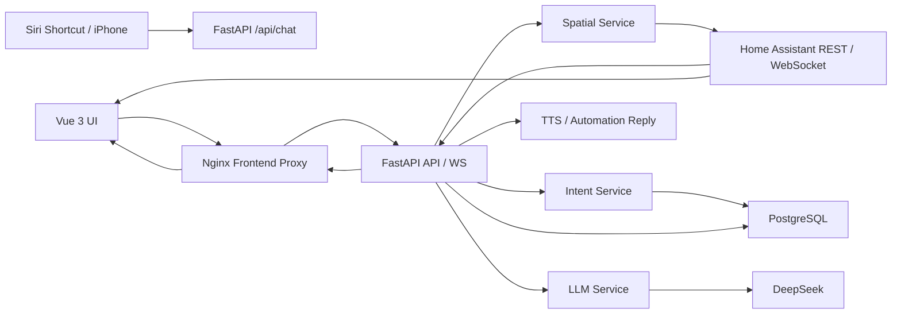

# smart_home_core

面向真实家庭场景的智能家居编排平台，基于 FastAPI、Vue 3、Docker、Home Assistant 与 DeepSeek 构建，提供统一设备控制、实时状态同步、空间场景建模、语音入口编排与 3D 户型工作台。

本项目的目标不是再造一个 Home Assistant，而是在其之上补齐更适合“家庭控制台”与“语音自动化入口”的能力层：更稳定的前后端分层、更清晰的权限模型、更适合空间理解的 LLM 编排链路，以及更直观的二维/三维空间控制体验。

## 核心价值

- **LLM 空间仲裁**：根据 `source_device`、房间上下文与短期意图记忆，对口语化指令进行空间归属与动作解析，降低“这个灯”“那个空调”类指令的歧义。
- **3D 户型工作台**：支持户型图上传、自动布局、空间场景数据生成，以及 GLB / GLTF 模型接入，形成从平面图到 3D 场景的统一控制视图。
- **实时同步与指数退避重连**：前端通过 WebSocket 接收状态更新，并采用指数退避重连策略，提升弱网络或 Home Assistant 波动场景下的可用性。
- **企业化权限边界**：前端代理默认只注入只读权限，控制操作通过 `control-session` 升级，避免浏览器长期持有高权限主密钥。
- **容器化交付**：提供本地一体化 Compose 与服务器模式 Compose，两种部署路径都围绕同一套环境变量模型组织。

## 架构总览



## 系统组成

- **前端**：Vue 3 + Pinia + Tailwind CSS，负责控制台、空间视图、3D 户型工作台与状态反馈。
- **前端代理层**：Nginx 提供静态资源托管，并为 `/api`、`/ws`、`/media` 提供同域代理。
- **后端**：FastAPI + SQLAlchemy 2.0，负责设备目录聚合、鉴权、控制执行、空间建模、语音编排与管理接口。
- **数据库**：PostgreSQL 15，保存房间、设备、区域、空间布局、待补充意图等持久化数据。
- **家居集成层**：Home Assistant REST / WebSocket，用于设备状态拉取、实体导入、控制动作下发与 TTS 播报。
- **LLM 能力层**：DeepSeek 用于自然语言意图分析；可选接入 OpenAI 视觉模型增强户型图结构识别。

## 关键能力

### 1. 统一家庭控制台

- 聚合房间、设备、区域与空间状态，适配灯光、空调、媒体、按钮、选择器、数值类设备等常见实体。
- 前端同时维护房间视图与空间场景视图，控制完成后主动刷新局部设备与空间数据，减少状态漂移。

### 2. 语音控制链路

- 入口：`POST /api/chat/`
- 输入：自然语言文本、来源设备、稳定用户标识。
- 流程：短期意图拼接 -> 空间仲裁 -> LLM 动作解析 -> Home Assistant 服务调用 -> TTS 播报结果。
- 对“补充说明”场景有原生支持，例如先说“把空调打开”，再补一句“客厅的”。

### 3. 空间建模与 3D 工作台

- 支持上传户型图并生成结构化空间分析。
- 支持自动布局房间和设备位置信息。
- 支持上传 GLB / GLTF 模型，将真实户型与 3D 视觉层结合。
- 前端提供沉浸式 3D 视图与二维编辑工作台，统一消费同一份空间场景数据。

### 4. 指数退避重连

- 前端 WebSocket 重连窗口从 `1s` 开始指数增长，最大退避到 `30s`。
- 适用于本地网络抖动、Home Assistant 重启、容器重建等高频运维场景。

## 权限模型

系统按作用域进行访问控制：

- `APP_READ_API_KEY`：读取房间、设备与 WebSocket 状态。
- `APP_CONTROL_API_KEY`：读取并控制设备，调用语音入口。
- `APP_ADMIN_API_KEY`：执行管理与导入操作。

前端默认工作方式：

- Nginx 代理会为浏览器侧 `/api/*` 与 `/ws/*` 注入 `APP_READ_API_KEY`。
- 浏览器不直接持有控制主密钥。
- 当用户执行控制动作时，前端通过 `POST /api/auth/control-session` 建立短期控制会话，再访问控制接口。

这种设计兼顾了“默认最小权限”与“前端仍可完成交互控制”的体验要求。

## 快速开始

### 1. 准备环境

请确保本机已安装：

- Docker 29+
- Docker Compose V2

### 2. 复制环境变量模板

```bash
cp .env.example .env
```

### 3. 填写关键配置

最少需要配置以下变量：

- `APP_READ_API_KEY`
- `APP_CONTROL_API_KEY`
- `APP_ADMIN_API_KEY`
- `APP_WEBHOOK_SECRET`
- `HOME_ASSISTANT_ACCESS_TOKEN`
- `DEEPSEEK_API_KEY`

强烈建议同时设置：

- `APP_AUTH_COOKIE_SECRET`
- `ALLOWED_ORIGINS`

如果需要启用户型图多模态增强分析，可额外配置：

- `APP_FLOOR_PLAN_ANALYSIS_PROVIDER`
- `APP_FLOOR_PLAN_VISION_MODEL`
- `OPENAI_API_KEY`
- `OPENAI_BASE_URL`

### 4. 启动本地一体化环境

```bash
docker compose up -d --build
```

### 5. 验证服务状态

```bash
docker compose ps
curl http://localhost:8000/health
```

预期访问地址：

- 前端控制台：`http://localhost`
- 后端健康检查：`http://localhost:8000/health`
- 后端 OpenAPI：`http://localhost:8000/docs`
- Home Assistant：`http://localhost:8123`

### 6. 验证前端代理链路

```bash
curl http://localhost/api/rooms
```

如果返回房间列表，说明 Nginx -> FastAPI 的只读代理链路已生效。

## 服务器模式部署

服务器模式使用独立编排文件：

```bash
docker compose -f docker-compose.server.yml up -d --build
```

该模式下：

- 后端默认映射宿主机 `8000`
- 前端仍监听 `80`
- Home Assistant 默认通过 `host.docker.internal:8123` 接入

如果 Home Assistant 并不运行在宿主机，请显式覆盖：

- `HOME_ASSISTANT_WS_URL`
- `HOME_ASSISTANT_REST_URL`

## 开发与质量验证

后端测试：

```bash
PYTHONPATH=backend .venv/bin/pytest backend/tests -q
```

前端构建：

```bash
npm --prefix frontend install
npm --prefix frontend run build
```

Compose 配置检查：

```bash
docker compose config
docker compose -f docker-compose.server.yml config
```

## 仓库结构

```text
smart_home_core/
├─ backend/
│  ├─ app/
│  │  ├─ routers/       # API、认证会话、空间、Realtime、语音入口
│  │  ├─ services/      # HA 集成、LLM、空间、意图、自动化、导入
│  │  ├─ database.py    # 数据库与运行时目录
│  │  ├─ models.py      # SQLAlchemy 模型
│  │  └─ schemas.py     # Pydantic 模型
│  └─ tests/            # 后端回归测试
├─ frontend/
│  ├─ src/
│  │  ├─ components/    # 控制台、空间视图、3D 工作台
│  │  ├─ stores/        # Pinia 状态管理
│  │  ├─ adapters/      # API / WS 数据适配
│  │  └─ composables/   # 交互与视觉逻辑
│  └─ nginx.conf.template
├─ docs/
│  ├─ DEPLOYMENT.md
│  ├─ VOICE_CONTROL_SETUP.md
│  ├─ PRODUCTION_CHECKLIST.md
│  └─ 3D_DESIGN_UPGRADE.md
├─ docker-compose.yml
├─ docker-compose.server.yml
└─ .env.example
```

## 文档导航

- [部署与联调指南](docs/DEPLOYMENT.md)
- [语音控制接入指南](docs/VOICE_CONTROL_SETUP.md)
- [生产环境检查清单](docs/PRODUCTION_CHECKLIST.md)
- [3D 设计升级方案](docs/3D_DESIGN_UPGRADE.md)

## 适用场景

- 家庭中控面板
- 基于 Siri / 快捷指令的语音自动化入口
- 多房间、多设备的空间化可视控制
- 需要在 Home Assistant 之上增加一层自定义业务编排的项目

## Architecture

- smartHome Store Contract: frontend/src/stores/smartHome.README.md

## License

当前仓库尚未附带单独的开源许可证文件；如果计划对外发布，建议在正式开源前补充 `LICENSE`、贡献指南与安全披露流程。
