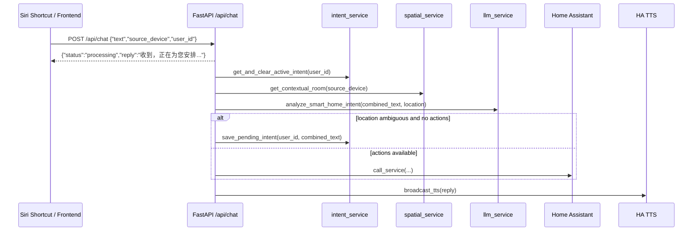

# 系统架构与后端逻辑

本文档面向维护者、后端工程师与二次开发者，解释 `smart_home_core` 当前的核心运行架构，重点覆盖语音命令链路、空间仲裁、短期意图记忆以及 LLM 意图分析的安全收敛机制。

## 1. 架构目标

本项目建立在 Home Assistant 之上，但并不直接把浏览器或 Siri Shortcut 暴露给 Home Assistant。系统在中间增加了一层应用服务，用于解决以下问题：

- 把自然语言请求转换为可执行、可验证的设备动作。
- 在多房间、多设备环境中做空间归属判断，减少歧义执行。
- 在“补充一句”的连续语音交互中保留短期上下文。
- 让前端、快捷指令、后端、LLM 与 Home Assistant 之间形成可观测、可扩展、可容错的调用链路。

从职责划分看：

- `frontend/` 负责用户交互、状态展示、控制反馈与空间可视化。
- `backend/app/routers/` 负责 API 入口、鉴权边界与 HTTP / WebSocket 协议层。
- `backend/app/services/` 负责空间判断、意图记忆、LLM 分析、Home Assistant 集成与自动化控制。
- `PostgreSQL` 负责保存设备目录、房间布局、空间场景与短期意图状态。
- `Home Assistant` 负责真实设备状态和实际动作执行。

## 2. 语音命令生命周期

当前语音入口位于 `POST /api/chat/`，由 [`chat.py`](/Users/jackalwonder/Desktop/smart_home_core/backend/app/routers/chat.py) 实现。它的设计重点是“快速响应用户 + 后台异步执行”。

### 2.1 生命周期概览



### 2.2 详细执行步骤

1. 客户端向 `POST /api/chat/` 发送语音文本、来源设备名称和稳定 `user_id`。
2. 路由层先通过 `BackgroundTasks` 派发 `process_voice_command(...)`，立即返回：

```json
{"status":"processing","reply":"收到，正在为您安排..."}
```

3. 后台任务首先读取并消费该 `user_id` 对应的短期意图。
4. 如果存在上一轮未过期的补充上下文，则把旧命令与新命令拼接成一条更完整的自然语言输入。
5. 系统根据 `source_device` 做空间仲裁，得到明确房间名，或返回 `AMBIGUOUS`。
6. `llm_service.py` 基于当前房间和设备清单生成严格 JSON 意图结果。
7. 如果空间不明确且 LLM 没有产生动作，系统会把上下文暂存 60 秒，等待下一句补充说明。
8. 如果 LLM 给出了动作列表，后端会逐条转换成 Home Assistant service call。
9. 无论成功还是失败，最终都会尝试通过 TTS 播报 `reply`。

### 2.3 为什么采用“立即响应 + 后台执行”

这种设计适合语音交互：

- 用户无需等待 LLM、Home Assistant 或 TTS 完整执行完成。
- iOS Shortcut 更容易在较短请求超时内获得确认回包。
- 后端可以在后台处理更长链路的网络调用和异常恢复。

## 3. 空间仲裁：`spatial_service.py`

空间仲裁的目标是回答一个问题：**“用户说的这句话，默认应该作用于哪个房间？”**

实现位于 [`spatial_service.py`](/Users/jackalwonder/Desktop/smart_home_core/backend/app/services/spatial_service.py)。

### 3.1 判定顺序

系统按两层策略做空间解析：

1. **静态来源映射**
2. **雷达占用状态推断**

### 3.2 第一层：静态来源映射

服务先检查 `STATIC_DEVICE_ROOM_MAP`，例如：

- `主卧的 HomePod -> 主卧`
- `客厅的 HomePod -> 客厅`
- `书房的 iPhone -> 书房`

这种方式延迟最低，也最稳定，适合明确绑定到房间的语音来源设备。

### 3.3 第二层：基于雷达传感器的实时推断

如果静态映射未命中，系统会调用 `HomeAssistantRestClient.from_env().get_states()` 拉取当前 Home Assistant 状态，并在其中筛选“处于激活状态的雷达类传感器”。

当前判定规则如下：

- `entity_id` 必须以 `binary_sensor.` 开头
- `state` 必须为 `on`
- `attributes.device_class` 必须属于：
  - `motion`
  - `presence`
  - `occupancy`

这组规则由 `_active_radar_entity_id(...)` 实现。

### 3.4 歧义处理规则

系统只在 **恰好一个房间有人** 时，才认为空间上下文明确。

也就是说：

- 如果没有任何激活雷达，返回 `AMBIGUOUS`
- 如果有多个激活雷达，返回 `AMBIGUOUS`
- 只有当激活雷达数量为 `1` 时，才继续查库映射房间

随后系统会在数据库中执行：

- 通过 `Device.ha_entity_id == active_radar_entity_id`
- 关联到 `Room`
- 取出对应 `Room.name`

如果数据库里找不到该雷达所属房间，同样返回 `AMBIGUOUS`。

### 3.5 这一策略的意义

这套策略故意偏保守：

- 宁可要求用户补充“哪个房间”，也不把动作误发到错误空间。
- 把“房间判定”变成一个显式前置条件，而不是让 LLM 猜测真实执行目标。
- 让空间归属优先由传感器与数据库映射决定，而不是由自然语言推断单独决定。

## 4. 短期意图记忆：`intent_service.py`

短期意图记忆用于承接这类连续交互：

- 第一句：“有点热。”
- 第二句：“客厅的。”

如果没有记忆层，第二句本身并不包含完整动作语义；有了记忆层，系统就能把它还原成完整上下文。

实现位于 [`intent_service.py`](/Users/jackalwonder/Desktop/smart_home_core/backend/app/services/intent_service.py)。

### 4.1 数据结构

该服务操作 `PendingIntent` 表，核心字段包括：

- `user_id`
- `original_command`
- `is_active`
- `created_at`

这里的 `user_id` 必须是稳定标识，例如某个固定 iPhone、某个固定家庭成员或某个快捷指令入口，而不是每次随机生成的 ID。

### 4.2 TTL 逻辑

当前 TTL 常量为：

```python
INTENT_TTL_SECONDS = 60
```

也就是说，待补充意图最多保留 60 秒。

### 4.3 保存逻辑

当语音链路满足以下条件时：

- `location == AMBIGUOUS`
- 且 `actions` 为空

系统会调用：

```python
await intent_service.save_pending_intent(user_id, combined_text)
```

写入一条新的激活记录，为下一句补充说明预留上下文。

### 4.4 读取与消费逻辑

在每次新的语音请求开始时，系统都会先调用：

```python
await intent_service.get_and_clear_active_intent(user_id)
```

该逻辑会：

1. 查找该 `user_id` 最近一条 `is_active=True` 的记录
2. 判断是否过期
3. 如果已过期：
   - 将其标记为 `is_active=False`
   - 返回 `None`
4. 如果未过期：
   - 将其标记为 `is_active=False`
   - 返回 `original_command`

注意这里是“**读取即消费**”模型，而不是可重复读取模型。这样可以避免同一条历史语音在多轮请求中被重复拼接。

### 4.5 时间处理细节

`_is_expired(created_at)` 会把无时区数据库时间统一解释为 UTC，然后再做 TTL 判断：

- 如果数据库时间没有 `tzinfo`，就 `replace(tzinfo=timezone.utc)`
- 如果已有时区，则统一 `astimezone(timezone.utc)`

这是为了避免数据库、应用服务器和容器时区不同导致的过期判断偏差。

### 4.6 后台清理循环

除了“读取时清理”，系统在应用生命周期里还启动了一个后台守护循环：

- 入口位于 [`main.py`](/Users/jackalwonder/Desktop/smart_home_core/backend/app/main.py)
- 每 60 秒执行一次 `intent_service.cleanup_expired_intents()`

作用是：

- 清理那些没有被再次读取、但已经过期的 `PendingIntent`
- 防止短期记忆表长期积累脏数据

换句话说，TTL 的执行分成两层：

- **同步消费层**：读取时立即判定是否过期
- **异步保洁层**：后台周期性扫表并失活过期数据

## 5. LLM 意图分析：`llm_service.py`

`llm_service.py` 负责把自然语言命令压缩为一个**严格可执行的 JSON 结构**，而不是让模型自由输出文本解释。

实现位于 [`llm_service.py`](/Users/jackalwonder/Desktop/smart_home_core/backend/app/services/llm_service.py)。

### 5.1 输入

`analyze_smart_home_intent(user_command, location)` 的输入包括：

- `user_command`：最终送入模型的自然语言指令
- `location`：由空间仲裁服务得出的房间名，或者 `AMBIGUOUS`

在真正调用 LLM 之前，服务还会动态构建 `device_context`，内容来自：

- PostgreSQL 中登记的 `Device` 与 `Room`
- Home Assistant 当前状态快照

上下文每一行都会带上：

- 房间名
- 设备名
- `entity_id`
- 当前状态
- 能力描述

例如一个 `climate` 设备上下文会包含：

- 支持 `turn_on|turn_off|toggle`
- 可选 `hvac_modes`
- 温度范围
- 温度步长

这样做的目的是把模型“可选动作空间”限制到当前真实设备能力，而不是让模型猜。

### 5.2 Prompt Engineering 设计

`_build_system_prompt(...)` 的核心思路是“显式约束 + 明确 schema + 明确禁止事项”。

Prompt 会明确告诉模型：

- 你是 smart home intent planner
- 必须输出严格 JSON
- 顶层 schema 固定为：

```json
{
  "actions": [
    {
      "ha_entity_id": "string",
      "action": "turn_on|turn_off|toggle|set_value|select_option|press|set_temperature|set_hvac_mode",
      "value": "optional numeric or string"
    }
  ],
  "reply": "string"
}
```

- `location == AMBIGUOUS` 时必须返回空动作和澄清性回复
- 只能引用 `device_context` 里出现的实体
- 不允许发明 `entity_id`
- 不允许发明 `options`
- 不允许为同一实体输出冲突动作
- `reply` 必须是简短自然中文
- 不允许输出 Markdown 或 JSON 之外的解释文本

### 5.3 为什么在 `AMBIGUOUS` 时直接短路

虽然 prompt 本身也包含 `AMBIGUOUS` 规则，但当前实现更进一步：

- 如果 `location == AMBIGUOUS`
- 则 `analyze_smart_home_intent(...)` **直接返回**

```json
{
  "actions": [],
  "reply": "我还不能确定你指的是哪个房间。请告诉我是哪个房间。"
}
```

不会真正调用 LLM。

这样做有三个好处：

- 降低无意义的 LLM 调用成本
- 把高风险分支变成纯本地逻辑
- 避免模型在空间不明确时仍尝试“猜一个房间”

### 5.4 JSON 模式与响应格式约束

调用 DeepSeek 时使用：

```python
response_format={"type": "json_object"}
```

再配合：

- `temperature=0`
- 结构化 system prompt

目标是让模型尽可能输出稳定、可解析、可验证的 JSON。

### 5.5 Pydantic 校验与回退机制

模型输出不会直接执行，而是会经过 `_parse_llm_response(content)`：

1. `json.loads(content)` 解析原始字符串
2. `LlmIntentResponse.model_validate(payload)` 做 Pydantic 校验
3. 只有校验通过，才返回 `model_dump()` 结果

当前使用的两个结构是：

- `LlmAction`
- `LlmIntentResponse`

并且都设置了：

```python
ConfigDict(extra="forbid", str_strip_whitespace=True)
```

这意味着：

- 多余字段会被拒绝
- 字符串会先做 `strip`
- `reply` 缺失、类型不匹配、字段结构不符都会视为非法输出

### 5.6 回退分支

以下情况都会触发回退：

- `ValidationError`
- `json.JSONDecodeError`
- 内容为空
- `DEEPSEEK_API_KEY` / `DEEPSEEK_BASE_URL` 缺失
- OpenAI SDK 异步客户端不可用
- 远端调用异常

回退结果统一为：

```json
{
  "actions": [],
  "reply": "抱歉，我暂时没能理解这条家居指令，请换一种说法再试一次。"
}
```

这保证了上游调用方永远可以拿到结构稳定的响应，而不是直接把异常、空字符串或模型原始错误暴露到执行链路里。

### 5.7 为什么“先校验再执行”很关键

Home Assistant 执行链路是高影响操作路径。模型即使只犯一个小错误，也可能导致：

- 对错误实体发指令
- 使用错误 action
- 使用错误 value 类型
- 在房间不明确时误控制设备

因此当前架构并不信任 LLM 原始输出，而是采取：

**设备上下文约束 -> JSON 输出约束 -> Pydantic 校验 -> 后端动作转换 -> Home Assistant service call**

这是整个语音链路可上线的基础。

## 6. 动作执行与 Home Assistant 映射

路由层拿到 `actions` 后，会在 `chat.py` 中逐条调用 `_build_service_call(...)`，将 LLM 动作映射成实际 Home Assistant service：

- `turn_on` -> `homeassistant.turn_on`
- `turn_off` -> `homeassistant.turn_off`
- `toggle` -> `homeassistant.toggle`
- `number.set_value`
- `select.select_option`
- `button.press`
- `climate.set_temperature`
- `climate.set_hvac_mode`
- `media_player.select_source`
- `media_player.volume_set`

这里再次做了一层类型与域校验，例如：

- `number` 必须能转成数值
- `select` 必须带有效字符串选项
- `media_player.volume_set` 会把大于 `1` 的值按百分比换算到 `0.0 ~ 1.0`

如果某条动作不合法，系统会跳过该动作并记录 warning，而不是让整个语音链路崩溃。

## 7. 异常处理策略

语音链路当前将异常分为三类：

- `ConfigurationError`
- `ExternalServiceError`
- 未知异常

无论异常发生在哪个阶段，系统都会尽量保证：

- 接口层已经快速返回“processing”
- 后台日志保留详细错误上下文
- 最终尽量通过 TTS 回给用户一条可理解的失败说明

默认失败回复为：

```text
抱歉，我这次没能成功执行，请稍后再试。
```

## 8. 设计原则总结

当前后端语音与空间架构遵循以下原则：

- **保守胜过冒进**：空间不明确时优先澄清，而不是猜测执行。
- **结构化胜过自由文本**：LLM 只输出 JSON，不直接驱动设备。
- **消费式短期记忆**：上下文只保留很短时间，并在读取后失活。
- **多层防线**：空间仲裁、prompt 约束、Pydantic 校验、动作映射各自承担一道防线。
- **面向真实家庭环境**：默认考虑多房间、多用户、网络波动、设备状态漂移与语音补充交互。

## 9. 后续可演进方向

如果后续要继续增强这一架构，优先级较高的方向包括：

- 将 `STATIC_DEVICE_ROOM_MAP` 配置化，而不是硬编码在服务中
- 为雷达仲裁引入“最近活跃时间”或“权重模型”，替代当前仅支持单一激活房间的硬规则
- 给 `PendingIntent` 增加更丰富的上下文字段，如 `source_device`、`last_location`
- 为 LLM 输出增加服务端二次语义校验，例如“实体是否确实属于当前房间”
- 为语音链路增加 tracing / request id 关联，便于跨组件排障
