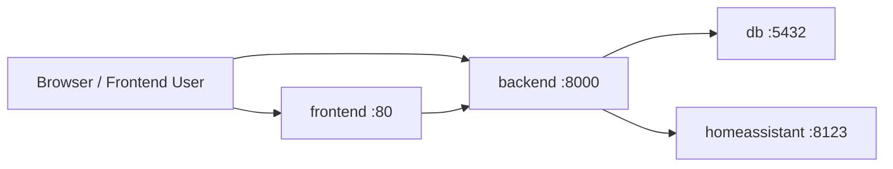
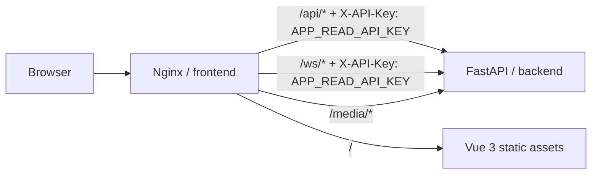

# 生产环境部署指南

本文档面向部署工程师、运维工程师与项目维护者，说明 `smart_home_core` 在本地开发与服务器部署场景下的推荐编排方式、网络拓扑、安全边界以及可用性设计。

文档基于当前代码库的真实实现编写，覆盖以下重点：

- `docker-compose.yml` 与 `docker-compose.server.yml` 的职责边界
- Nginx 同域反向代理与 `APP_READ_API_KEY` 注入模型
- FastAPI / SQLAlchemy 数据库连接池加固
- Docker `healthcheck` 与 `condition: service_healthy` 的启动顺序保障

## 1. 部署目标

当前部署设计围绕三个目标展开：

- **开发体验一致**：本地开发可以直接打开前端、直连后端并观察完整链路。
- **前端零密钥硬编码**：浏览器侧不保存主 API Key，不通过前端 bundle 传递高权限凭据。
- **服务启动有序且可恢复**：数据库、后端、前端按健康状态逐层启动，减少“先启动但不可用”的假成功状态。

## 2. 双模式编排总览

仓库提供两套 Compose 文件：

- [`docker-compose.yml`](/Users/jackalwonder/Desktop/smart_home_core/docker-compose.yml)：本地一体化开发与联调
- [`docker-compose.server.yml`](/Users/jackalwonder/Desktop/smart_home_core/docker-compose.server.yml)：服务器部署与外部 Home Assistant 对接

### 2.1 对比表

| 维度 | 本地模式 `docker-compose.yml` | 服务器模式 `docker-compose.server.yml` |
| --- | --- | --- |
| 典型用途 | 本机联调、开发验证、快速演示 | 服务器常驻运行、接入宿主机或外部 Home Assistant |
| 数据库服务名 | `db` | `postgres` |
| Home Assistant 网络方式 | 普通容器网络 + 端口映射 | `network_mode: host` |
| 后端访问 Home Assistant | `http://homeassistant:8123/api` | `http://host.docker.internal:8123/api` |
| 后端宿主机端口 | 固定映射 `8000:8000` | `${BACKEND_PORT:-8000}:8000` |
| 前端宿主机端口 | `80:80` | `80:80` |
| Home Assistant 宿主机端口 | `${HOME_ASSISTANT_PORT:-8123}:8123` | 由 `host` 网络直接继承宿主机监听 |
| 前端构建参数 | 默认构建 | 支持 `VITE_API_BASE_URL` build arg |
| 适用环境 | 单机、本地 Docker Desktop、开发机 | Linux 服务器、网关主机、长期运行节点 |

### 2.2 一个重要说明

早期本地模式只在容器内部 `expose 8000`，不映射宿主机端口。当前版本已经显式调整为：

```yaml
ports:
  - "8000:8000"
```

这样做的原因是让以下本地开发体验保持一致：

- 可以直接访问 `http://localhost:8000/health`
- 可以直接访问 `http://localhost:8000/docs`
- 可以在调试 API、排查鉴权或验证 CORS 时绕开 Nginx 单独访问 FastAPI

因此，当前的“本地模式 vs 服务器模式”差异，不再体现在“是否暴露后端 8000”，而主要体现在：

- Home Assistant 的网络接入方式
- 后端端口是否参数化
- 是否强调宿主机级集成

## 3. 本地开发模式

本地模式由 [`docker-compose.yml`](/Users/jackalwonder/Desktop/smart_home_core/docker-compose.yml) 定义，默认启动以下服务：

- `homeassistant`
- `db`
- `backend`
- `frontend`

### 3.1 启动命令

```bash
cp .env.example .env
docker compose up -d --build
```

### 3.2 本地模式网络关系



### 3.3 本地模式适合什么

- 联调前后端接口
- 调试 Swagger / OpenAPI
- 验证 Nginx 同域代理
- 开发空间建模、3D 视图、语音链路
- 快速检查 `docker compose` 变更是否影响端到端流程

### 3.4 本地模式访问入口

- 前端：`http://localhost`
- 后端健康检查：`http://localhost:8000/health`
- 后端 OpenAPI：`http://localhost:8000/docs`
- Home Assistant：`http://localhost:8123`

## 4. 服务器部署模式

服务器模式由 [`docker-compose.server.yml`](/Users/jackalwonder/Desktop/smart_home_core/docker-compose.server.yml) 定义，适合以下情况：

- Home Assistant 已经运行在宿主机
- 需要让后端与 Home Assistant 更稳定地进行局域网通信
- 需要在固定服务器上长期运行前端、后端与数据库

### 4.1 启动命令

```bash
cp .env.example .env
docker compose -f docker-compose.server.yml up -d --build
```

### 4.2 服务器模式关键差异

#### 4.2.1 Home Assistant 走 host 网络

服务器模式中的 `homeassistant` 使用：

```yaml
network_mode: host
```

这意味着：

- Home Assistant 直接使用宿主机网络栈
- 不再依赖 Docker bridge 内部端口转发
- 更适合需要局域网广播、设备发现或已有宿主机 Home Assistant 环境的场景

#### 4.2.2 后端通过 `host.docker.internal` 回连宿主机

后端默认使用：

```yaml
HOME_ASSISTANT_WS_URL=ws://host.docker.internal:8123/api/websocket
HOME_ASSISTANT_REST_URL=http://host.docker.internal:8123/api
```

并通过：

```yaml
extra_hosts:
  - "host.docker.internal:host-gateway"
```

把容器内的 `host.docker.internal` 解析到宿主机网关地址。

这样做的好处是：

- 后端配置不需要写死某台宿主机私网 IP
- Docker 与宿主机之间的边界更稳定
- 更适合部署脚本与环境模板复用

#### 4.2.3 后端端口参数化

服务器模式中后端端口写法为：

```yaml
ports:
  - "${BACKEND_PORT:-8000}:8000"
```

这意味着：

- 默认仍暴露宿主机 `8000`
- 也可以通过 `.env` 覆盖为其他端口
- 更适合与已有网关、反向代理或宿主机服务共存

## 5. 环境变量准备

根目录 `.env` 是两套 Compose 文件共用的核心配置入口。

### 5.1 基础必填项

至少应配置：

- `APP_READ_API_KEY`
- `APP_CONTROL_API_KEY`
- `APP_ADMIN_API_KEY`
- `APP_WEBHOOK_SECRET`
- `HOME_ASSISTANT_ACCESS_TOKEN`
- `DEEPSEEK_API_KEY`

### 5.2 强烈建议配置

- `APP_AUTH_COOKIE_SECRET`
- `ALLOWED_ORIGINS`
- `POSTGRES_PASSWORD`

### 5.3 可选增强项

如果要启用户型图多模态增强识别：

- `APP_FLOOR_PLAN_ANALYSIS_PROVIDER`
- `APP_FLOOR_PLAN_VISION_MODEL`
- `OPENAI_API_KEY`
- `OPENAI_BASE_URL`

## 6. Nginx 反向代理与凭据隐匿

这是当前部署架构中最重要的工程化亮点之一。

### 6.1 为什么需要 Nginx 同域网关

前端浏览器如果直接访问 FastAPI，会带来几个问题：

- 浏览器需要跨域访问 `http://localhost:8000`
- 前端 bundle 容易误把 API Key 写入静态资源
- API / WebSocket / 媒体资源会分散在多个 origin 上

因此当前架构使用 Nginx 作为单一入口：

- 浏览器始终访问 `http://<host>`
- Nginx 决定哪些请求转发到 FastAPI
- 前端代码不关心真实后端容器地址

### 6.2 反向代理流量图



### 6.3 当前代理行为

[`frontend/nginx.conf.template`](/Users/jackalwonder/Desktop/smart_home_core/frontend/nginx.conf.template) 对以下路径做转发：

- `/api`
- `/api/`
- `/ws`
- `/ws/`
- `/media/`

其中：

- `/api/*` 会代理到 `${BACKEND_UPSTREAM}/api/*`
- `/ws/*` 会代理到 `${BACKEND_UPSTREAM}/ws/*`
- `/media/*` 会代理到 `${BACKEND_UPSTREAM}/media/*`

### 6.4 `APP_READ_API_KEY` 注入模型

对 `/api/*` 和 `/ws/*`，Nginx 会直接注入：

```nginx
proxy_set_header X-API-Key "${APP_READ_API_KEY}";
```

这意味着：

- 浏览器永远不需要显式保存 `APP_READ_API_KEY`
- 更不需要保存 `APP_CONTROL_API_KEY` 或 `APP_ADMIN_API_KEY`
- 前端构建产物中不会出现高权限主密钥

### 6.5 这一设计解决了什么问题

#### 6.5.1 彻底解决跨域

浏览器只访问一个 origin：

- 页面：`/`
- API：`/api/*`
- WebSocket：`/ws/*`
- 媒体资源：`/media/*`

因此不需要在前端里维护一套跨域 API 地址和 WebSocket 地址，也减少了 CORS 误配置。

#### 6.5.2 彻底避免前端硬编码密钥

API Key 不再通过：

- `import.meta.env.VITE_API_KEY`
- `localStorage`
- URL Query String
- 浏览器常量文件

等方式暴露在客户端。

#### 6.5.3 强化最小权限原则

Nginx 只注入 `APP_READ_API_KEY`，不注入控制权限密钥。

因此默认前端只能：

- 读房间
- 读设备
- 建立只读 WebSocket

真正的控制操作通过 `control-session` 机制升级为短期控制会话，而不是长期在浏览器中保存高权限凭据。

## 7. 数据库连接池加固

数据库接入由 [`backend/app/database.py`](/Users/jackalwonder/Desktop/smart_home_core/backend/app/database.py) 统一管理。

当前 `create_engine(...)` 关键参数如下：

```python
engine = create_engine(
    DATABASE_URL,
    echo=False,
    future=True,
    pool_size=20,
    max_overflow=10,
    pool_timeout=30,
    pool_recycle=1800,
    pool_pre_ping=True,
)
```

### 7.1 `pool_recycle=1800`

这表示连接在池中存活超过 `1800` 秒后会被回收重建。

工程意义：

- 防止数据库或中间网络设备悄悄断开长连接
- 减少连接长期闲置后再次复用失败的概率
- 避免在高峰时刻把“陈旧连接”集中爆发成请求失败

尤其在以下环境里很有价值：

- 云数据库
- NAT / SLB / 防火墙中间存在空闲超时
- PostgreSQL 长连接被网络设备半关闭但应用层尚未知晓

### 7.2 `pool_pre_ping=True`

这表示 SQLAlchemy 在从连接池取出连接时，会先做一次轻量存活探测。

工程意义：

- 能在“连接看似存在、其实已经死掉”的情况下提前识别问题
- 避免把死连接直接交给业务请求使用
- 降低偶发 `OperationalError` 传播到应用接口层的概率

### 7.3 为什么这两项要一起使用

它们解决的是两个不同层次的问题：

- `pool_recycle=1800`：控制连接生命周期，避免连接过老
- `pool_pre_ping=True`：在连接出池时做即时健康确认

两者结合后，可以显著降低：

- 死连接复用
- 连接池耗尽前的雪崩失败
- 长时间运行容器中的偶发数据库断连

### 7.4 线程池会话隔离

除了连接池参数本身，`run_in_threadpool_session(...)` 还要求线程池任务为自己创建独立 `Session`：

- 不跨线程复用请求作用域的 `Session`
- 出错时立即 `rollback`
- 最终保证 `close`

这能降低复杂后台任务、导入任务和异步包装逻辑下的会话污染风险。

## 8. Docker 健康检查与严格启动顺序

这是当前部署设计中的第二个关键工程化亮点。

### 8.1 数据库健康检查

PostgreSQL 容器使用：

```yaml
healthcheck:
  test:
    [
      "CMD-SHELL",
      "pg_isready -U ${POSTGRES_USER:-smart_home_user} -d ${POSTGRES_DB:-smart_home}"
    ]
  interval: 10s
  timeout: 5s
  retries: 5
  start_period: 10s
```

这表示数据库容器只有在真正接受连接后，才会进入 `healthy`。

### 8.2 后端健康检查

FastAPI 容器使用：

```yaml
healthcheck:
  test:
    [
      "CMD-SHELL",
      "curl -f http://localhost:8000/api/health || exit 1"
    ]
  interval: 30s
  timeout: 5s
  retries: 3
  start_period: 20s
```

这表示后端不仅要进程启动，还要做到：

- Uvicorn 已监听 `8000`
- FastAPI 路由已挂载完成
- `/api/health` 可以返回成功状态

### 8.3 启动顺序控制

Compose 中显式使用：

```yaml
depends_on:
  db:
    condition: service_healthy
```

和：

```yaml
depends_on:
  backend:
    condition: service_healthy
```

服务器模式中同理，只是数据库服务名改为 `postgres`。

### 8.4 这解决了什么问题

没有健康检查时，常见失败模式是：

- PostgreSQL 容器刚启动，但还未真正 ready
- FastAPI 进程已经启动，却在首次数据库访问时报错
- Nginx 页面已经可打开，但 API 全部 502 / 503

有了 `condition: service_healthy` 之后，启动顺序变成：

1. 先等数据库 ready
2. 再启动后端
3. 再等后端 `/api/health` healthy
4. 最后启动前端

这会显著降低冷启动阶段的脆弱性。

## 9. 推荐部署步骤

### 9.1 本地联调

```bash
cp .env.example .env
docker compose up -d --build
docker compose ps
curl http://localhost:8000/health
curl http://localhost/api/rooms
```

### 9.2 服务器部署

```bash
cp .env.example .env
docker compose -f docker-compose.server.yml up -d --build
docker compose -f docker-compose.server.yml ps
curl http://localhost:8000/health
curl http://localhost/api/rooms
```

### 9.3 配置检查

在真正部署前，建议先渲染配置：

```bash
docker compose config
docker compose -f docker-compose.server.yml config
```

这可以提前发现：

- 环境变量未注入
- 端口冲突
- 代理目标错误
- `BACKEND_PORT` 或 `HOME_ASSISTANT_*` 覆盖不正确

## 10. 生产环境配置建议

### 10.1 不要使用模板默认密码

以下默认值仅用于模板占位，不适用于生产：

- `POSTGRES_PASSWORD=change_me`
- `APP_*_API_KEY=replace_with_*`

### 10.2 为 Cookie 单独配置密钥

务必显式设置：

```dotenv
APP_AUTH_COOKIE_SECRET=<long-random-secret>
```

不要依赖后端用 API keys 自动派生 Cookie secret 的退化逻辑。

### 10.3 限制前端暴露范围

虽然前端默认只注入 `APP_READ_API_KEY`，但前端入口仍然是业务主入口，建议：

- 仅暴露在内网
- 或置于 VPN / SSO / 反向代理鉴权之后
- 或配合网关白名单、身份认证、WAF

### 10.4 明确配置 `ALLOWED_ORIGINS`

如果后端需要被其他域名直连，请显式设置：

```dotenv
ALLOWED_ORIGINS=https://your-ui.example.com,https://ops.example.com
```

## 11. 常见排障

### 11.1 前端页面能打开，但 API 全部失败

优先检查：

- `frontend` 容器是否拿到 `APP_READ_API_KEY`
- `BACKEND_UPSTREAM` 是否指向正确的 `backend:8000`
- `backend` 是否已变为 `healthy`
- Nginx 模板是否已正确渲染

### 11.2 后端启动后偶发数据库错误

优先检查：

- PostgreSQL 是否稳定可达
- `DATABASE_URL` 是否与当前 Compose 模式一致
- 连接池是否因外部网络设备空闲超时被回收
- 容器是否频繁重启导致连接正在被重建

### 11.3 服务器模式下无法连接 Home Assistant

优先检查：

- `host.docker.internal` 在当前宿主机是否可解析
- Home Assistant 是否真的监听宿主机 `8123`
- 是否需要显式覆盖 `HOME_ASSISTANT_REST_URL`
- 是否需要显式覆盖 `HOME_ASSISTANT_WS_URL`

### 11.4 `frontend` 长时间不启动

优先检查：

- `backend` 是否卡在 `starting`
- `curl -f /api/health` 是否在后端容器内成功
- 数据库是否已 healthy

## 12. 工程化设计总结

当前部署体系的核心不是“把几个容器跑起来”，而是把运行边界设计清楚：

- 用 **双模式 Compose** 区分开发与服务器运行语义
- 用 **Nginx 同域网关** 解决跨域与前端密钥泄漏
- 用 **只读密钥注入** 保持最小权限默认值
- 用 **连接池加固** 提升长时间运行的数据库稳定性
- 用 **健康检查 + 严格依赖顺序** 避免冷启动阶段的脆弱链路

这套结构为后续扩展网关、TLS、外层反向代理、集中日志、监控和 CI/CD 留出了足够清晰的基础边界。
